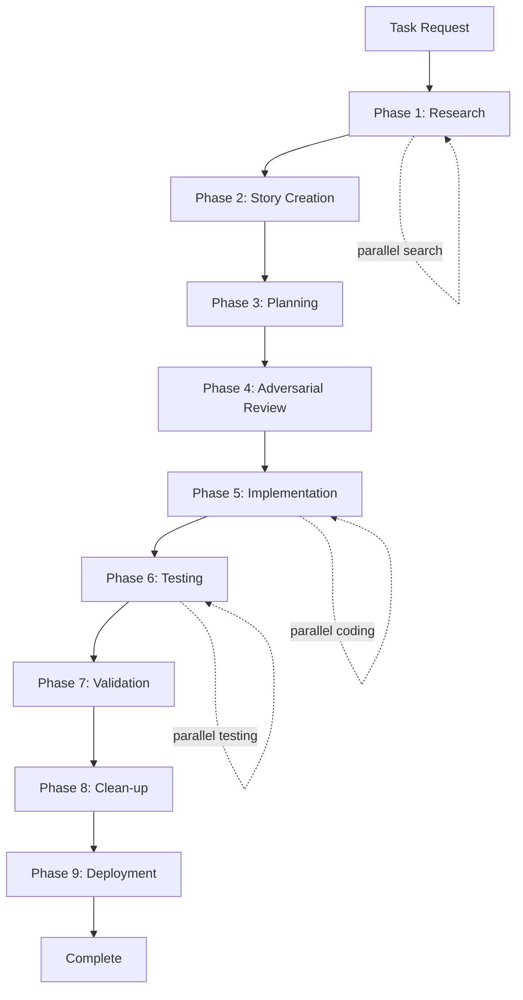

# Atlas Agent-Driven Workflow

## Overview

The Atlas workflow has evolved from manual script execution to an intelligent agent-orchestrated system. Each phase is now handled by specialized AI agents that work in parallel when possible, dramatically improving speed and quality.

**⚠️ NOTE**: This document describes the **Full (9-phase) workflow** for complex features and epics. For most tasks, use the **Standard (5-phase)** workflow instead. See [WORKFLOW_TIERS.md](WORKFLOW_TIERS.md) for guidance on choosing the right tier.

## Agent Architecture

### Available Agent Types

| Agent | Type | Specialization | Phases |
|-------|------|----------------|--------|
| Researcher | `general-purpose` | Deep codebase exploration | Phase 1 |
| Product Manager | `product-manager` | Requirements & validation | Phases 2, 7 |
| Developer | `developer` | Technical planning & coding | Phases 3, 5 |
| Debugger | `debugger` | Diagnosis without code changes | As needed |
| Security | `security` | Vulnerability auditing | Phase 4 |
| Peer Reviewer | `peer-reviewer` | Quality & edge cases | Phases 4, 6 |
| UX Analyst | `ux-analyst` | UI/UX review | Phase 6 |
| DevOps | `devops` | Deployment, CI/CD, quality gates | Phase 9 |

## Complete Workflow



## Phase-by-Phase Agent Usage

### Phase 1: Research (Researcher Agent)

**Trigger Command:**
```
Launch a general-purpose agent to research [TASK DESCRIPTION].
Find all related files, understand implementation, identify dependencies,
and document patterns. Search extensively and in parallel.
```

**Parallel Opportunities:**
- Multiple grep searches
- File pattern matching
- Documentation searches
- Test file discovery

### Phase 2: Story Creation (Product Manager Agent)

**Trigger Command:**
```
Launch a product-manager agent to create a story for [TASK DESCRIPTION].
Use research findings: [RESEARCH SUMMARY].
Create comprehensive acceptance criteria and success metrics.
Output story to your project's story directory (e.g., backlog/sprint-X/STORY-X.Y-name.md)
```

**Key Outputs:**
- User story document (location per project conventions)
- Acceptance criteria
- Success metrics
- Requirements documentation

**Note**: Story location and naming conventions are project-specific. Common patterns include `backlog/`, `stories/`, or `docs/stories/`.

### Phase 3: Planning (Developer Agent)

**Trigger Command:**
```
Launch a developer agent to create implementation plan for [STORY ID].
Detail all file changes, technical approach, and implementation order.
```

### Phase 4: Adversarial Review (Security & Peer Reviewer Agents)

**Trigger Command:**
```
Launch agents in parallel:
1. Security agent to audit for vulnerabilities in [STORY ID] plan
2. Peer-reviewer agent to find edge cases and missing requirements
```

**Review Focus:**
- Security vulnerabilities
- Edge cases
- Performance implications
- Missing requirements

### Phase 5: Implementation (Developer Agent)

**Trigger Command:**
```
Launch a developer agent to implement [STORY ID] following the approved plan.
Make changes incrementally and test as you go.
```

**Parallel Execution:**
```
Launch multiple developer agents in parallel:
- Agent 1: Frontend changes
- Agent 2: Backend changes
- Agent 3: Test updates
- Agent 4: Documentation updates
```

### Phase 6: Testing (UX Analyst + Peer Reviewer)

**Trigger Command:**
```
Launch agents in parallel:
1. UX-analyst agent to verify UI/UX implementation of [STORY ID]
2. Peer-reviewer agent for code quality review
```

**Test Coverage:**
- UI/UX compliance
- Functional testing
- Edge case validation
- Cross-platform consistency

### Phase 7: Validation (Product Manager Agent)

**Trigger Command:**
```
Launch product-manager agent to validate [STORY ID] implementation.
Verify all acceptance criteria are met and provide sign-off.
```

### Phase 8: Clean-up (General-Purpose Agent)

**Trigger Command:**
```
Launch general-purpose agent to clean up after [STORY ID].
Remove temp files, update documentation, close story, and organize evidence.
Ensure all documentation follows project conventions.
```

**Note**: Documentation standards and locations are project-specific.

## Orchestration Patterns

### Sequential Execution
```
Agent 1 completes → Agent 2 starts → Agent 3 starts
```

### Parallel Execution
```
Launch multiple agents simultaneously:
- Researcher agents for different search patterns
- Developer agents for independent components
- Test agents for different platforms
```

### Hand-off Pattern
```
Researcher → Product Manager → Developer → Peer Reviewer
     ↓            ↓              ↓            ↓
  findings      story          code        review
```

## Example: Complete Feature Implementation

```markdown
User: "I need to add a dark mode toggle to settings"

You: I'll orchestrate the Atlas agent workflow for this feature.

## Phase 1: Research
*Launch general-purpose agent for research*
"Research dark mode requirements: find theme files, settings implementation,
and UI components that need theme support."

## Phase 2: Story Creation
*Launch product-manager agent*
"Create story for dark mode toggle using research findings. Include acceptance
criteria for theme switching, persistence, and UI updates."

## Phase 3: Planning
*Launch developer agent*
"Create implementation plan for ATLAS-XXX dark mode story. Detail theme
service, settings UI, and component updates."

## Phase 4: Adversarial Review
*Launch parallel agents*
- Security: "Audit dark mode plan for security vulnerabilities"
- Peer Reviewer: "Review for edge cases and missing requirements"

## Phase 5: Implementation
*Launch multiple developer agents in parallel*
- Agent 1: "Implement theme service and state management"
- Agent 2: "Update UI components for theme support"
- Agent 3: "Add settings toggle and persistence"

## Phase 6: Testing
*Launch parallel testing agents*
- UX Analyst: "Verify dark mode UI/UX across all screens"
- Peer Reviewer: "Review code quality and patterns"

## Phase 7: Validation
*Launch product-manager agent*
"Validate dark mode implementation meets all acceptance criteria"

## Phase 8: Clean-up
*Launch general-purpose agent*
"Clean up dark mode implementation artifacts and update documentation"
```

## Agent Coordination Rules

### 1. Parallel Execution Guidelines
- Use parallel agents when tasks are independent
- Batch similar operations together
- Coordinate results before proceeding

### 2. Hand-off Requirements
- Each agent provides clear outputs
- Next agent receives complete context
- No information lost between phases

### 3. Checkpoint Management
- User confirms after each phase
- Agents report completion status
- Clear progress visibility

### 4. Error Handling
- Agents report blockers immediately
- Fallback to sequential if parallel fails
- Maintain work artifacts for debugging

## Benefits Over Script-Based Workflow

| Aspect | Old (Scripts) | New (Agents) | Improvement |
|--------|--------------|--------------|-------------|
| Speed | Sequential only | Parallel execution | 3-5x faster |
| Quality | Manual review | Specialized agents | Higher consistency |
| Coverage | Human-dependent | Systematic | More thorough |
| Documentation | Often skipped | Automatic | Always complete |
| Clean-up | Manual | Organized agent | No debt accumulation |

## Best Practices

### DO ✅
- Launch agents in parallel when possible
- Provide clear, specific prompts
- Use specialized agents for their strengths
- Let agents complete their phase fully
- Save agent outputs for hand-offs

### DON'T ❌
- Skip phases to save time
- Merge agent responsibilities
- Ignore agent recommendations
- Override agent findings
- Proceed without checkpoints

## Migration from Script-Based Workflow

### Instead of:
```bash
python3 atlas/atlas_workflow.py feature "description"
```

### Use:
```
"I need to [TASK DESCRIPTION]. Please orchestrate the Atlas agent workflow,
launching appropriate agents for each phase. Execute in parallel where possible."
```

## Troubleshooting

### Agent Confusion
**Problem**: Agent unsure of task
**Solution**: Provide more specific context and examples

### Hand-off Failures
**Problem**: Information lost between agents
**Solution**: Explicitly pass outputs as inputs

### Parallel Conflicts
**Problem**: Agents modifying same files
**Solution**: Partition work clearly or run sequentially

### Quality Issues
**Problem**: Agent missing edge cases
**Solution**: Use peer-reviewer agent more aggressively

## Measuring Success

### Speed Metrics
- Research: 5-10 minutes (was 30+)
- Implementation: 20-30 minutes (was 2+ hours)
- Full workflow: Under 1 hour (was 4+ hours)

### Quality Metrics
- Defect escape rate: Near zero
- Test coverage: Comprehensive
- Documentation: Always complete
- Technical debt: None added

## Advanced Patterns

### Multi-Platform Development
```
Launch developers in parallel:
- developer: "Implement iOS-specific features"
- developer: "Implement Android-specific features"
- developer: "Implement shared logic"
```

### Complex Refactoring
```
Phase 1: Multiple researchers for different subsystems
Phase 3: Architecture agent for design
Phase 5: Team of developers for parallel refactoring
```

### Emergency Fixes
```
Streamlined flow with parallel execution:
- Researcher + Peer Reviewer (find issue and risks)
- Developer + QA Tester (fix and verify)
- Organizer (clean up and document)
```

## 🚨 CRITICAL: Deployment Methodology

### MANDATORY: Use Project's Quality Deployment Script

After completing ANY feature implementation, bug fix, or change, you MUST use your project's quality deployment script. This is NOT optional.

**PREREQUISITE**: Your project must have a `deploy_qual.sh` script (or equivalent) in your deployment directory that enforces quality gates. This script is project-specific and not included in Atlas.

**Deployment Command:**
```bash
# Standard deployment (both platforms)
./deploy/deploy_qual.sh both

# Android only
./deploy/deploy_qual.sh android

# iOS only
./deploy/deploy_qual.sh ios
```

### ⛔ NEVER Skip Tests Without Explicit Approval

**ABSOLUTE RULE**: Tests must NEVER be skipped without explicit user approval. This includes:
- NO skipping for convenience
- NO skipping for "emergencies"
- NO skipping for "quick fixes"
- NO skipping for "minor changes"

The user MUST explicitly approve test skipping with clear, unambiguous language.

### Test Enforcement Protocol

1. **DEFAULT BEHAVIOR**: Tests always run
   ```bash
   ./deploy/deploy_qual.sh both
   # Tests run automatically - this is mandatory
   ```

2. **IF TESTS FAIL**:
   - FIX the failing tests
   - Do NOT proceed with deployment
   - Do NOT look for workarounds
   - Do NOT skip tests

3. **REQUESTING PERMISSION TO SKIP**:
   If you believe tests must be skipped:
   - STOP the deployment
   - EXPLAIN to the user:
     - Which tests are failing
     - Why they are failing
     - Risks of skipping
     - Recommended fixes
   - WAIT for explicit written approval
   - User must say: "Skip tests for this deployment" or equivalent
   - Vague approvals are NOT sufficient

4. **WITH EXPLICIT PERMISSION ONLY**:
   ```bash
   # ONLY after user explicitly approves in writing
   SKIP_TESTS=true ./deploy/deploy_qual.sh both
   ```

### Quality Gates (Enforced by Your Project's deploy_qual.sh)

Your project's deployment script should enforce quality gates such as:
1. **Test Coverage**: ALL tests must pass (unless explicitly overridden)
2. **Code Quality**: Static analysis must pass (e.g., SonarCloud, linters)
3. **Build Success**: All platforms must build successfully
4. **Clean Git State**: No uncommitted changes (recommended)
5. **Local Deployment**: Must deploy successfully to devices/emulators

**Note**: Each project implements these gates according to their specific requirements.

### Phase 9: Deployment (DevOps Agent)

**Trigger Command:**
```
Launch a devops agent to deploy [STORY ID] using the project's deploy_qual.sh.
Ensure all tests pass, quality gates are met, and deployment is successful.
Do NOT skip tests without explicit user approval.
```

**Agent Responsibilities:**
- Run project's `deploy_qual.sh` (or equivalent) with appropriate parameters
- Monitor test execution (NEVER skip without permission)
- Handle build processes for all platforms
- Verify quality gates (static analysis, tests, etc.)
- Create proper commit messages
- Tag versions when appropriate
- Report deployment status

**Note**: The deployment script path and parameters are project-specific. Consult your project's deployment documentation.

**Deployment Workflow:**

```markdown
## Phase 9: Quality Deployment (DevOps Agent)

*Launch DevOps agent:*
"Deploy the completed feature using deploy_qual.sh. Ensure all tests pass.
If any tests fail, fix them before proceeding. Do not skip tests."

*DevOps agent executes:*
./deploy/deploy_qual.sh both

*If tests fail:*
- Agent reports specific failures
- Agent attempts fixes or requests developer assistance
- Agent does NOT skip tests without explicit permission

*On success:*
- Changes are committed to Git
- Version is tagged if appropriate
- Local deployment is verified
- Quality metrics are recorded
```

### Emergency Override Protocol

In EXTREMELY RARE cases where deployment must proceed despite failures:

1. **EXPLAIN** the emergency situation in detail
2. **GET** explicit written approval from user
3. **DOCUMENT** everything:
   ```bash
   SKIP_TESTS=true \
   SKIP_SONAR=true \
   COMMIT_MESSAGE="emergency: [Detailed reason] - User explicitly approved bypassing checks" \
   ./deploy/deploy_qual.sh both
   ```
4. **CREATE** immediate follow-up tasks to fix issues
5. **NEVER** make this a habit or standard practice

### Deployment Best Practices

**DO**:
- ✅ Always use deploy_qual.sh for deployments
- ✅ Fix test failures before deploying
- ✅ Include descriptive commit messages
- ✅ Verify deployment success
- ✅ Document any issues encountered

**DON'T**:
- ❌ Skip tests without explicit permission
- ❌ Use manual git commits for feature code
- ❌ Deploy with known failures
- ❌ Bypass quality gates
- ❌ Assume "small changes" don't need testing

### Example Deployment Scenarios

**Standard Feature Deployment:**
```bash
COMMIT_MESSAGE="feat: Add dark mode toggle" ./deploy/deploy_qual.sh both
```

**Bug Fix Deployment:**
```bash
COMMIT_MESSAGE="fix: Resolve photo import crash" ./deploy/deploy_qual.sh both
```

**Sprint Completion:**
```bash
COMMIT_MESSAGE="feat: Sprint 5 - Complete backup and sharing features" \
TAG_VERSION=true \
./deploy/deploy_qual.sh both
```

## Conclusion

The agent-driven Atlas workflow represents a paradigm shift from manual, sequential processes to intelligent, parallel execution. By leveraging specialized agents for each phase and enabling parallel operations, we achieve faster delivery with higher quality and better documentation.

The deployment phase using `deploy_qual.sh` is MANDATORY and ensures that all code meets quality standards before being committed. Tests are NEVER skipped without explicit user approval - this is an absolute rule with no exceptions for convenience or emergencies.

The key is not just using agents, but orchestrating them effectively - knowing when to parallelize, how to hand off context, and where human checkpoints add value. This approach scales from simple bug fixes to complex feature development, always maintaining the Atlas principles of quality and thoroughness, with deployment quality guaranteed by the mandatory use of deploy_qual.sh.