# Atlas Workflow Visualization

## The 7-Phase Atlas Workflow

## Parallel Execution Pattern

## Evidence-Driven Development Flow

```mermaid
flowchart TB
    subgraph "Evidence Throughout Development"
        Start([Begin Task]) --> Research[Research Phase]
        Research --> RE[📄 research-phase.md]

        RE --> Story[Story Creation]
        Story --> SE[📄 story-ATLAS-XXX.md]

        SE --> Plan[Planning]
        Plan --> PE[📄 implementation-plan.md]

        PE --> Review[Adversarial Review]
        Review --> RVE[📄 review-findings.md]

        RVE --> Implement[Implementation]
        Implement --> IE[📄 implementation-log.md]

        IE --> Test[Testing]
        Test --> TE[📄 test-results.md]

        TE --> Validate[Validation]
        Validate --> VE[📄 validation-report.md]

        VE --> Final[Final Report]
        Final --> FE[📄 WAVE-X-FINAL-REPORT.md]

        FE --> End([Complete])
    end

    %% Styling
    classDef evidence fill:#e8f5e9,stroke:#2e7d32,stroke-width:2px,color:#000
    classDef phase fill:#e3f2fd,stroke:#1976d2,stroke-width:2px,color:#000

    class RE,SE,PE,RVE,IE,TE,VE,FE evidence
    class Research,Story,Plan,Review,Implement,Test,Validate phase
```

## Component Decomposition Strategy

## Mode-Aware Architecture Flow

## Success Metrics Dashboard

## Key Takeaways

### The Workflow Works Because:
1. **Enforced Checkpoints** - Can't skip ahead
2. **Evidence at Each Phase** - Not just at the end
3. **Adversarial Review** - Catches issues early
4. **Parallel Execution** - 3-5x speed improvement
5. **Pragmatic Limits** - 250 lines, 30% coverage

### The Anti-Patterns to Avoid:
- ❌ Skipping research to "save time"
- ❌ Writing code before planning
- ❌ Batching evidence at the end
- ❌ Complex automation over simple scripts
- ❌ Perfect over practical

### The Success Formula:
**Structure + Pragmatism + Parallel Execution + Evidence = Success**