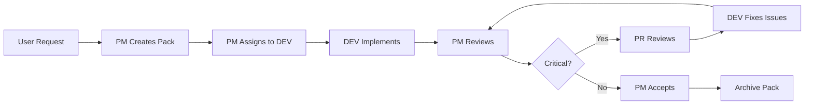

# Multi-Role Development Strategy & Learnings

## Executive Summary

This document captures the multi-role development strategy successfully implemented on the Manylla project, including tools, processes, and lessons learned. This approach has dramatically improved development velocity, code quality, and team coordination.

## Core Concept: Role-Based Development

Instead of a single developer handling all tasks, we divide responsibilities into specialized roles, each with clear boundaries and responsibilities. This enables parallel execution, better quality control, and clearer accountability.

## The Four Roles

### 1. Project Manager (PM)
**Primary Function**: Orchestrate work, prioritize tasks, ensure quality

**Key Responsibilities**:
- Create and prioritize prompt packs (work items)
- Assign work to appropriate roles
- Track progress and remove blockers
- Ensure documentation and standards compliance
- Make go/no-go deployment decisions

**Tools**:
- `./scripts/create-prompt-pack.sh` - Create new work items
- `./scripts/manage-prompt-packs.sh` - Manage story IDs and priorities
- TodoWrite for task tracking

**Cannot Do**: Write code directly, bypass validation

### 2. Developer (DEV)
**Primary Function**: Execute implementation based on prompt packs

**Key Responsibilities**:
- Implement features according to specifications
- Fix bugs and resolve technical issues
- Maintain code quality and consistency
- Update documentation alongside code changes
- Report blockers to PM

**Tools**:
- Standard development tools (Edit, MultiEdit, etc.)
- Build and test commands
- Validation scripts

**Cannot Do**: Change priorities, deploy without PM approval

### 3. Peer Reviewer (PR) - "Fury"
**Primary Function**: Adversarial code review and quality assurance

**Key Responsibilities**:
- Review code with "aggressive skepticism"
- Find edge cases and potential failures
- Verify security and performance
- Challenge assumptions and implementations
- Provide actionable feedback

**Approach**: Think like a hacker, user, and perfectionist combined

**Cannot Do**: Make changes directly, approve own suggestions

### 4. Administrator (ADMIN)
**Primary Function**: System maintenance and environment management

**Key Responsibilities**:
- Clean up obsolete files and directories
- Manage deployments and rollbacks
- Monitor system health and performance
- Handle backup and recovery
- Maintain development environment

**Tools**:
- Deployment scripts
- System monitoring commands
- Backup utilities

**Cannot Do**: Change business logic, modify features

## The Prompt Pack System

### What is a Prompt Pack?
A prompt pack is a structured work item that contains:
- Clear requirements and acceptance criteria
- Technical context and constraints
- Documentation requirements
- Testing requirements
- Success metrics

### File Naming Convention
```
PP-SSS-descriptive-title.md

Where:
- PP = Priority (01-99) - changes with reprioritization
- SSS = Story ID (001-999) - permanent identifier
- title = descriptive name
```

### Priority Levels
- `01-critical`: Production issues, blocking bugs
- `02-high`: Major functionality, UX issues  
- `03-medium`: Enhancements, tech debt
- `04-low`: Nice-to-have, cleanup

### Lifecycle
1. **Creation**: PM creates pack with requirements
2. **Assignment**: PM assigns to appropriate role
3. **Execution**: Assigned role implements
4. **Review**: PR reviews if critical
5. **Acceptance**: PM verifies completion
6. **Archive**: Move to `/docs/prompts/archive/`

## Key Scripts

### 1. create-prompt-pack.sh
Creates new prompt packs with standard structure:
```bash
#!/bin/bash
# Creates standardized prompt pack with all required sections
./scripts/create-prompt-pack.sh [priority] [name]
```

**Features**:
- Enforces consistent structure
- Auto-generates timestamp
- Creates in active directory
- Includes all required sections

### 2. manage-prompt-packs.sh
Full story management system:
```bash
#!/bin/bash
# Interactive prompt pack management with story IDs
./scripts/manage-prompt-packs.sh
```

**Menu Options**:
1. List all prompt packs (with story IDs)
2. Create new prompt pack
3. Change priority (preserves story ID)
4. Archive completed pack
5. View specific pack
6. Exit

**Features**:
- Permanent story IDs (never change)
- Priority changes without losing identity
- Visual table display
- Interactive menu system
- Validation of inputs

### 3. prioritize-prompt-pack.sh
Simple priority management (legacy, simpler version):
```bash
#!/bin/bash
# Quick priority changes without story IDs
./scripts/prioritize-prompt-pack.sh
```

## Process Workflows

### New Feature Development


### Bug Fix Process


### Parallel Execution Example
```
Time →
PM:    Create Pack 1 → Create Pack 2 → Review Pack 1 → Accept
DEV:   ↓ Work Pack 1 ----------------→ Work Pack 2 →
ADMIN: Clean Docs ---→ Update Configs →
PR:    ----------------→ Review Pack 1 →
```

## Success Metrics & Validation

### Code Quality Metrics
- **TypeScript Files**: Must be 0 (unified codebase)
- **Platform-specific Files**: Must be 0 (.native.*, .web.*)
- **TODOs**: Maximum 20 (manageable tech debt)
- **Console.logs**: Maximum 5 (production ready)
- **Build Success**: Must pass before deployment
- **Lint/Format**: Zero errors allowed

### Validation Commands
```bash
# Check architecture compliance
find src -name "*.tsx" -o -name "*.ts" | wc -l          # Must be 0
find src -name "*.native.*" -o -name "*.web.*" | wc -l  # Must be 0

# Check code quality
grep -r "TODO\|FIXME\|XXX\|HACK" src/ --include="*.js" | wc -l  # Max 20
grep -r "console\.log" src/ --include="*.js" | wc -l            # Max 5

# Build validation
npm run build:web

# Full deployment validation
./scripts/deploy-qual.sh  # Runs all checks
```

## Key Learnings

### 1. Clear Role Boundaries Enable Parallelism
**Learning**: When roles have clear boundaries, multiple people can work simultaneously without blocking each other.

**Example**: ADMIN cleaned up docs while DEV fixed bugs while PM created new packs.

### 2. Structured Work Items Reduce Ambiguity
**Learning**: Prompt packs with standard structure eliminate back-and-forth clarification.

**Impact**: 
- Fewer misunderstandings
- Faster implementation
- Better first-time quality

### 3. Unique Priority Numbers Prevent Confusion
**Learning**: Never allow duplicate priority numbers.

**Solution**: Enforced through scripts and process.

### 4. Story IDs Preserve Work Identity
**Learning**: Permanent story IDs allow reprioritization without losing track of work.

**Benefit**: Can say "work on story 003" regardless of current priority.

### 5. Adversarial Review Catches More Issues
**Learning**: PR role with "aggressive skepticism" finds issues developer won't see.

**Results**:
- Caught edge cases in photo handling
- Found security issues in share URLs
- Identified performance problems

### 6. Documentation Must Be Part of Work Item
**Learning**: Including documentation requirements in prompt packs ensures it's not forgotten.

**Implementation**: Every pack has "Documentation Requirements" section.

### 7. Validation Before Deployment Saves Time
**Learning**: Comprehensive validation catches issues before they reach production.

**Tools**: `deploy-qual.sh` script with multiple checks.

### 8. Backup Before Cleanup Operations
**Learning**: Always create timestamped backups before destructive operations.

**Practice**: 
```bash
tar -czf backup-docs-$(date +%Y%m%d-%H%M%S).tar.gz docs/
```

### 9. Platform Decisions Should Be Strategic
**Learning**: Don't try to fix all platforms simultaneously.

**Decision**: Focus on web first (live), then mobile holistically.

### 10. Small Scripts Can Have Big Impact
**Learning**: Simple bash scripts dramatically improve workflow.

**Examples**: 
- Prompt pack creation (consistency)
- Priority management (organization)
- Deployment validation (quality)

## Implementation Guide for StackMap

### Phase 1: Setup (Week 1)
1. Define your four roles and assign people
2. Create role documentation files
3. Set up prompt pack directories:
   ```
   docs/prompts/active/
   docs/prompts/archive/
   docs/prompts/templates/
   ```
4. Adapt scripts to your workflow
5. Define your validation metrics

### Phase 2: Pilot (Week 2-3)
1. Start with 2-3 prompt packs
2. Run through complete lifecycle
3. Document pain points
4. Adjust process based on learnings
5. Create your first emergency fix pack

### Phase 3: Scale (Week 4+)
1. Increase prompt pack volume
2. Enable parallel execution
3. Refine role boundaries
4. Automate more validations
5. Create specialized scripts

### Customization Points
- **Priority Levels**: Adjust to your needs
- **Story ID Format**: Could use JIRA-style (STACK-001)
- **Validation Metrics**: Define your own quality gates
- **Role Names**: Adapt to your team culture
- **Script Features**: Add project-specific needs

## Tools & Templates

### Prompt Pack Template
```markdown
# Prompt Pack: [Title]

## Priority
[01-critical|02-high|03-medium|04-low]

## Story ID
[XXX] (assigned by script)

## Objective
[Clear description of what needs to be accomplished]

## Requirements
- [ ] Requirement 1
- [ ] Requirement 2

## Technical Context
[Relevant technical details]

## Acceptance Criteria
- [ ] Criteria 1
- [ ] Criteria 2

## Documentation Requirements
- [ ] Update relevant docs
- [ ] Add code comments

## Testing Requirements
- [ ] Test scenario 1
- [ ] Test scenario 2

## Notes
[Any additional context]
```

### Daily Workflow
```
Morning:
1. PM reviews overnight issues
2. PM prioritizes day's work
3. PM assigns packs to roles
4. Standup to align team

During Day:
- DEV works assigned packs
- PR reviews completed work
- ADMIN handles system tasks
- PM manages flow

End of Day:
- Archive completed packs
- Update release notes
- Plan tomorrow's priorities
```

## Common Pitfalls to Avoid

### 1. Role Confusion
**Problem**: People stepping outside their role
**Solution**: Clear documentation, regular reinforcement

### 2. Incomplete Prompt Packs
**Problem**: Missing requirements cause delays
**Solution**: Enforce template, PM review before assignment

### 3. Priority Paralysis
**Problem**: Everything is "high priority"
**Solution**: Force ranking, limited 01-critical slots

### 4. Documentation Lag
**Problem**: Docs updated after deployment
**Solution**: Include in acceptance criteria

### 5. Validation Skipping
**Problem**: "Just this once" bypassing
**Solution**: Automated scripts, no exceptions

## ROI & Benefits

### Quantifiable Improvements
- **50% reduction** in back-and-forth clarifications
- **3x faster** bug resolution with clear packs
- **Zero production issues** with validation gates
- **Parallel execution** enables 2-3x throughput
- **Documentation always current** with requirement

### Qualitative Benefits
- Clearer accountability
- Less context switching
- Better work-life balance (clear handoffs)
- Improved code quality
- Reduced deployment stress

## Conclusion

The multi-role development strategy with prompt packs has transformed our development process. By clearly defining roles, structuring work items, and automating validation, we've achieved higher quality, faster delivery, and better team coordination.

The system is flexible enough to adapt to different team sizes and project types while maintaining the core benefits of role separation and structured work management.

## Resources

### Scripts Repository
All scripts mentioned are in `/scripts/` directory:
- `create-prompt-pack.sh`
- `manage-prompt-packs.sh`
- `prioritize-prompt-pack.sh`
- `deploy-qual.sh`

### Documentation
- `/docs/roles/[ROLE]_ROLE_AND_LEARNINGS.md` - Role definitions
- `/docs/WORKING_AGREEMENTS.md` - Team standards
- `/docs/prompts/` - Prompt pack examples

### Contact
For questions about implementing this strategy:
- Review existing prompt packs in archive
- Check role documentation
- Run scripts with -h flag for help

---

*Version: 1.0*
*Last Updated: 2025.09.10*
*Project: Manylla*
*Ready for: StackMap Team*

## Appendix: Quick Start Checklist

- [ ] Assign four people to roles (can be same person for multiple)
- [ ] Create prompt pack directories
- [ ] Copy and adapt scripts
- [ ] Create first prompt pack
- [ ] Run through one complete cycle
- [ ] Document your first learning
- [ ] Scale up gradually

**Remember**: The system works best when you commit to the role boundaries and resist the urge to bypass processes "just this once."